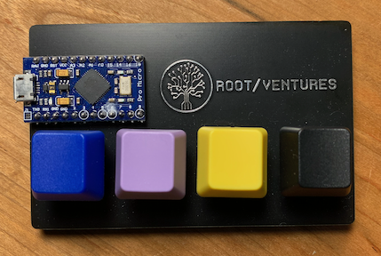

## TonerPad

What model of toner catridge does your printer take? To answer this question you have to know your printer model, and then you hvae to dig through a manufacturers website trying to find useful information bured amongst popups and marketing materials. Invariably, when you do find the proper toner cartidges, you forget to write this information down; and then you have to repeat the whole process again in seven months when the next toner cartridge reports that it is empty.

You need a **TonerPad** - a dedicated keyboard that will pull up toner info for your color laser printer.

### Usage

Plug the **TonerPad** into a free USB port on your Mac computer. Press the button corresponding to the color of toner that you need. The product page will open up in your web browser. If you want the high yield toner cartridge, then long press the button (about half a second); you will be taken to the high capacity product page.

That's it! Nothing could be easier!

### Arduino

The board on the keypad is an [Arduino pro micro](https://deskthority.net/wiki/Arduino_Pro_Micro) with a micro USB connector and built-in AVR programmmer. This means that you can plug the board into your computer, fire up the Arduino IDE, and immediately start uploading sketches to the board.

The [keypad.ino](keypad/keypad.ino) sketch in this main branch contains the basic building blocks for the two projects.