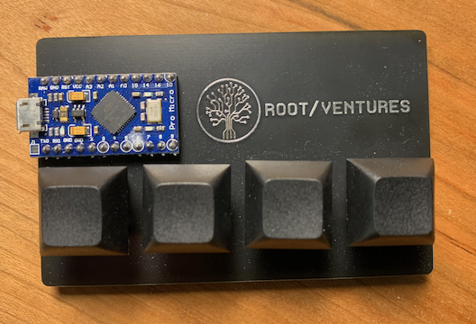

## KeyDeck

The Elgato [Stream Deck](https://www.elgato.com/en/stream-deck) is a very nice piece of hardware, but what it could really use are some tactile clicky keys. Enter the **KeyDeck** - an Arduino powered mechanical keypad for one button automations on your Mac.

Each key supports a short press and a long press (about half a second) for a total of eight actions that can be performed. The **KeyDeck** emits keyboard events that are received [Hammerspoon](https://www.hammerspoon.org) which then takes the appropriate action. With tools like [Home Control](https://pvieito.com/2022/01/automate-homekit-with-homecontrol) you can even trigger home automation scenes and actions.

### How it Works

When you press one of the buttons on the keypad, a preconfigured set of keyboard key strokes are sent to the Mac computer. For example, pressing the second button emits the following four key strokes all at once: `⌘`+`⌥`+`⌃`+`2`.

Hammerspoon, running on the Mac, receives these key strokes and invokes the corresponding action found in the [`hammerspoon/init.lua`](hammerspoon/init.lua) script. This particular action is found on [line 33](hammerspoon/init.lua#L33) - it activates a HomeKit scene called "Forest".

Apple (in their infinite wisdom) has not exposed a HomeKit API to MacOS. A developer out on the internet decided to fix this oversight by creating "Home Control", a little menubar app that interfaces with HomeKit devices. The nice thing about "Home Control" is that it provides an `x-callback-url` scheme. Hammerspoon can create and send these URLs, and therefore, control HomeKit devices. Thank you Pedro José Pereira Vieito.

### Resources

The Arduino, Gateron switches, and custom PCB all came from the good folks over at [Root Ventures](https://root.vc). Thank you for this fun little keypad.

Hammerspoon has been automating Mac computers for nearly a decade now. It has a great set of documentation, and there are lots of discussion on the internet about creating useful functions and keybindings.

Home Control is definitely worth the money if you have gone all-in on Apple's HomeKit ecosystem.

Since you can launch any application with a single key press, it might be worth your while investing in some custom keycaps. I've purchased keycaps from [WASD](https://www.wasdkeyboards.com) in the past, and they have been prompt reliable. You can have a [creeper key](https://www.wasdkeyboards.com/creeper-cherry-mx-keycap.html) for launching Minecraft, or a even upload your own [custom art](https://www.wasdkeyboards.com/custom-art-cherry-mx-keycaps.html) to get that true Elgato Stream Deck experience.

The Arduino board is a [pro micro](https://deskthority.net/wiki/Arduino_Pro_Micro) with a micro USB connector and built-in AVR programmer. This means that you can plug the board into your computer, fire up the Arduino IDE, and immediately start uploading sketches to the board.

The [keypad.ino](keypad/keypad.ino) sketch contains the full source code for this project. All the automation is handled by Hammerspoon, so the sketch shouldn't need any changes (unless you want to use a different set of key presses for Hammerspoon).
